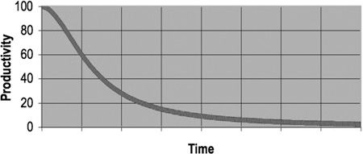

## Warum ist Code Qualität wichtig?

- Programmieren ist hauptsächlich Implementierung von neuen Features <!-- .element: class="fragment" data-fragment-index="0" -->
- Der Code kompiliert, macht was er soll, somit ist alles in Ordnung <!-- .element: class="fragment" data-fragment-index="1" -->
- Fachbereiche bezahlen für Features, nicht für "schönen" Code <!-- .element: class="fragment" data-fragment-index="2" -->

---

- Das Verhältnis von Code lesen zu schreiben ist 10:1 (!) <!-- .element: class="fragment" data-fragment-index="0" -->
- Die meiste Zeit wird existierender Code gelesen und evtl. erweitert <!-- .element: class="fragment" data-fragment-index="1" -->
  - Wartung ist die längste Phase des Produktlebenszyklus <!-- .element: class="fragment" data-fragment-index="1" -->
  - Trifft auch zu, wenn ein komplett neues Modul geschrieben wird <!-- .element: class="fragment" data-fragment-index="1" -->
- Du bist nicht allein! <!-- .element: class="fragment" data-fragment-index="2" -->
  - Entwickler arbeiten in Teams <!-- .element: class="fragment" data-fragment-index="2" -->

---

- Sinkende Produktivität über die Zeit bei unordentlichem Code

Quelle: Clean Code - A Handbook of Agile Software Craftsmanship (R.C. Martin)

---

## Probleme mit chaotischem Code

- Schwer zu verstehen <!-- .element: class="fragment" data-fragment-index="0" -->
  - und noch viel schwerer zu erweitern <!-- .element: class="fragment" data-fragment-index="0" -->
- Neue Fehler schleichen sich bei Änderungen leichter ein <!-- .element: class="fragment" data-fragment-index="1" -->
- Sinkende Produktivität <!-- .element: class="fragment" data-fragment-index="2" -->
- Das Chaos wächst, wenn man nicht mit Umsicht handelt! <!-- .element: class="fragment" data-fragment-index="3" -->

---

## Broken window theory

> A building with broken windows looks like nobody cares about it. So other people stop caring. They allow more windows to become broken. Eventually they actively break them.

Dave Thomas and Andy Hunt

(Ursprünglich von den Sozialforscher James Q. Wilson and George L. Kelling, März 1982)

---

## Definitionen von Clean Code

----

> Clean code reads like well-written prose. Clean code never obscures the designer's intent but rather is full of crisp abstractions and straightforward lines of control.

Grady Booch

----

> Clean code can be read, and enhanced by a developer other than its original author.

Dave Thomas

----

> Clean code always looks like it was written by someone who cares.

Michael Feathers

----

> Always code as if the guy who ends up maintaining your code will be a violent psychopath who knows where you live.

Martin Golding

---

## Wann ist Code clean, sauber, aufgeräumt?

- Einfach und direkt <!-- .element: class="fragment" data-fragment-index="0" -->
- Aussagekräftige Namen <!-- .element: class="fragment" data-fragment-index="1" -->
- Tut immer das, was man erwartet <!-- .element: class="fragment" data-fragment-index="2" -->
- Einfach zu lesen und erweiterbar <!-- .element: class="fragment" data-fragment-index="3" -->
- ... <!-- .element: class="fragment" data-fragment-index="3" -->

- "Clean code does one thing well" <!-- .element: class="fragment" data-fragment-index="4" -->
