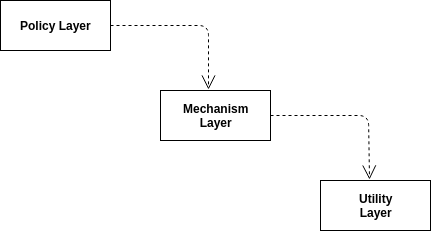
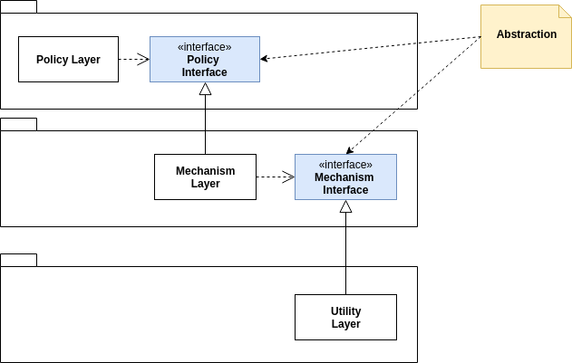

## SOLID

<div class="background-info" style="margin-bottom: 20px;">"P" steht immer für "Principle"</div>

- SRP: Single Responsibility <!-- .element: class="fragment" data-fragment-index="0" -->
- OCP: Open/Close <!-- .element: class="fragment" data-fragment-index="1" -->
- LSP: Liskov Substitution <!-- .element: class="fragment" data-fragment-index="2" -->
- ISP: Interface Segregation <!-- .element: class="fragment" data-fragment-index="3" -->
- DIP: Dependency Inversion <!-- .element: class="fragment" data-fragment-index="4" -->

---

### Single Responsibility Principle

> A module should have only one reason to change

<cite>Robert C. Martin</cite>

----


<cite class="small">From: Agile Principles, Patterns and Practices in C#, Robert C. Martin</cite>

----


<cite class="small">From: Agile Principles, Patterns and Practices in C#, Robert C. Martin</cite>

----

```csharp
class SomeService {
    void DoMagic(string message) {

        var emailService = new EmailService { Credentials = "bar" };

        try { emailService.Send(message); } 
        catch (Exception e) { /* ... */ }

        _smsService.Send(message);
    }
}
```

```csharp
class SomeServiceBetter {
    private readonly IEmailService _emailService;
    private readonly ISmsService smsService;

    SomeServiceBetter(IEmailService emailSrv, ISmsService smsService) {
        _emailService = emailSrv;
        _smsService = smsService;
    }

    void DoMagic(string message) {
        _emailService.Send(message);
        _smsService.Send(message);
    }
}
```

----

```csharp
class Rectangle {
    // ...
    int width;
    int height;

    void Draw() {
        // draw to output device
    }

    int CalculateArea() => width * height;
}
```

```csharp
class GeometricRectangle {
    // ...
    int width;
    int height;

    int CalculateArea() => width * height;
}

class Rectangle {
    void Draw() {
        // draw to output device
    }
}
```

----

#### Live coding

...zuerst eine kurze **Werbepause**...

----

#### Werbeblock ;-)

- Dojos, Katas
- Softwerkskammer, Meetups
- Online Plattformen (exercism.io, pluralsight, ...)
- Was ist FizzBuzz?

**Now some code...**

Wenn was unklar ist: Fragen

---

### Open/Close Principle

> Software entities ... should be open for extension, but closed for modification.

<cite>Bertran Meyer / Robert C. Martin</cite>

----


<cite class="small">From: Agile Principles, Patterns and Practices in C#, Robert C. Martin</cite>

----


<cite class="small">From: Agile Principles, Patterns and Practices in C#, Robert C. Martin</cite>

----

```csharp
class SomeService {
    
    void DoMagic(string message) {
        _emailService.Send(message);
        _smsService.Send(message);
    }
}
```

```csharp
class SomeServiceBetter {

    private readonly List<IService> _services;

    SomeServiceBetter(List<IService> services) {
        _services = services;
    }

    void DoMagic(string message) {
        for (var service in _services) {
            service.Send(message);
        }
    }
}
```

----

#### Live coding

Wenn was unklar ist: Fragen!

---

### Liskov Substitution Principle

> Objects in a program should be replaceable with instances of their subtypes without altering the correctness of that program.

<cite>Barbara Liskov</cite>

----

```csharp
class Base {
    virtual int DoSomethingWithNumber(int i) => i;
}

class OtherNotOk : Base {
    override int DoSomethingWithNumber(int i) 
        => i == 42
            ? i
            : throw new Exception(); // <- NOT OK!!
}

class OtherOk : Base {
    override int DoSomethingWithNumber(int i) => i * 100;
}
```

----

#### Live coding

Wenn was unklar ist: Fragen!

---

### Interface Segregation Principle

> Many client-specific interfaces are better than one general-purpose interface.

<cite>Robert C. Martin</cite>

----

```csharp
interface IPerson {
    Guid Id { get; set; }
    string FirstName  { get; set; }
    string LastName  { get; set; }
    Address Address  { get; set; }
    List<PersonalDetail> PersonalDetails  { get; set; }
}

class Person : IPerson {
    Guid Id { get; set; }
    string FirstName  { get; set; }
    string LastName  { get; set; }
    Address Address  { get; set; }
    List<PersonalDetail> PersonalDetails  { get; set; }
}
```

- Randnotiz: <!-- .element: class="fragment" data-fragment-index="1" -->
  - this is a **Java Bean** -> pointless <!-- .element: class="fragment" data-fragment-index="1" -->
    - (JEE violates most aspects of OO, even more than .NET) <!-- .element: class="fragment" data-fragment-index="1" -->
- violates ISP <!-- .element: class="fragment" data-fragment-index="1" -->

----

Typische Anforderungen:

- Listenansicht (wenig Information pro Eintrag)
- Detailansicht (viele Informationen)

----

```csharp
interface IPersonDetailViewModel {
    Guid Id { get; set; }
    string FirstName { get; set; }
    string LastName { get; set; }
    string Address { get; set; }
}

class PersonDetailViewModel : IPersonDetailViewModel {
    Guid Id { get; set; }
    string FirstName { get; set; }
    string LastName { get; set; }
    Address Address  { get; set; }
}
```

```csharp
interface IPersonListViewModel {
    Guid Id { get; set; }
    string Name { get; set; }
}

class PersonListViewModel : IPersonListViewModel {
    Guid Id { get; set; }
    string Name { get; set; }
}
```

----

```csharp
IPersonListViewModel ConvertToListViewModel(Person person) 
    => new PersonListViewModel(person);

IPersonDetailViewModel ConvertToDetailViewModel(Person person) 
    => new PersonDetailViewModel(person);
```

```csharp
class PersonListViewModel : IPersonListViewModel {
    // ctor
    PersonListViewModel(Person person) {
        Id = person.Id;
        Name = $"{person.LastName}, {person.FirstName}";
    }
    // ...
}
```

```csharp
class PersonDetailViewModel : IPersonDetailViewModel {
    // ctor
    PersonDetailViewModel(Person person) {
        Id = person.Id;
        FirstName = person.FirstName;
        LastName = person.LastName;
        Address = person.Address;
    }
    // ...
}
```

----

Typische Anforderung:

- Schnittstelle: **GetPeople**
- Schnittstelle: **GetPersonById**

----

```csharp
class Person : IPerson  { /*...*/ }

class PersonService {
    List<IPerson> GetPeople() { /*...*/ }
    IPerson GetPersonById(Guid id) { /*...*/ }
}

class PersonController {
    //...
    ActionResult PeopleList() {
        var people = _personService.GetPeople();
        return people; // View has unused infos in model!
    }
}
```

----

```csharp
class Person : IPersonListEntry, IPersonDetail  { /*...*/ }

class PersonService {
    List<IPersonListEntry> GetPeople() { /*...*/ }
    IPersonDetail GetPersonById(Guid id) { /*...*/ }
}

class PersonController {
    //...
    ActionResult PeopleList() {
        var people = _personService.GetPeople();
        return people; // View model is optimized
    }
}
```

----

#### Live coding

Wenn was unklar ist: Fragen!

---

### Dependency Inversion Principle

> High-level modules should not depend on low-level modules. Both should depend on abstractions.
> 
> Abstractions should not depend upon details. Details should depend upon abstractions.

<cite>Robert C. Martin</cite>

----



<cite class="small">From: Agile Principles, Patterns and Practices in C#, Robert C. Martin</cite>

----



<cite class="small">From: Agile Principles, Patterns and Practices in C#, Robert C. Martin</cite>

----

#### Live coding

Wenn was unklar ist: Fragen!
